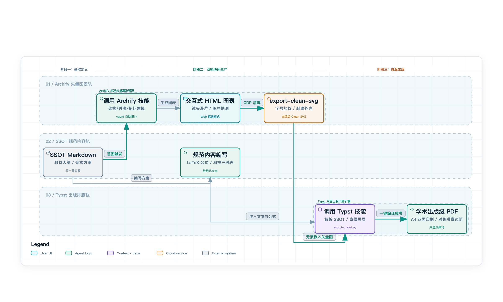
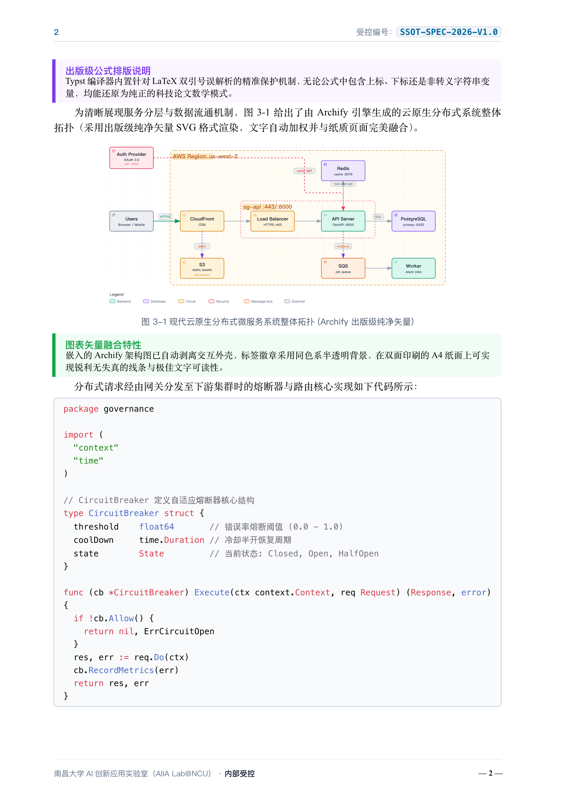

# AI 教育者 Agent 技能集 (Educator Toolkit Skills)

欢迎来到 **Educator Toolkit Skills**！这里汇集了专为 AI Coding Agent（如 Google Antigravity、Claude Code、Cursor、Windsurf 等）定制的专业级自动化技能包。

通过引入标准化的 Agent 技能，AI 助手不再只是通用的文本生成器，而是具备**符合教育学规范、出版级排版精度和工程制图水准**的专业助教。

---

## 🧭 技能清单 (Skills Catalog)

| 技能名称 | 目录 | 核心定位 | 关键能力 |
| :--- | :--- | :--- | :--- |
| **Archify** | [`skills/archify/`](./archify/) | 架构与工程可视化引擎 (基于开源项目改造) | <ul><li>支持架构图、时序图、数据流图、状态机等 5 大图表族</li><li>双轨模式：浏览器富交互探索 + 出版级纯净矢量（Clean SVG）导出</li><li>自动字号优化 (+2.5px)、半透明同色系徽章、无交互外壳残留</li><li>专为高校教材、学术论文与科研方案排版设计</li></ul> |
| **Typst** | [`skills/typst/`](./typst/) | 单一事实源 (SSOT) 出版级编译器 | <ul><li>A4 双面印刷排版（对称书脊装订边距、奇偶动态页眉）</li><li>科技论文三线表排版引擎</li><li>LaTeX 数学公式与变量双引号保护</li><li>集成 4090 Kroki 算力与原生矢量图嵌入</li></ul> |

---

## ⚡ 核心联动工作流：出版级学术材料生产线

`Archify` 与 `Typst` 构成了强大的学术级出版生产流水线，彻底打破了“画图模糊、排版错位、格式割裂”的长期痛点：

<p align="center">
  
</p>

> 💡 **生产线全景架构解析**：
> 1. **单一事实源驱动 (SSOT)**：所有教材教案、技术设计与拓扑架构均源自同一套受控 Markdown 文档，杜绝割裂维护；
> 2. **Archify 纯净矢量清洗**：AI Agent 自动识别系统组件并生成交互式拓扑，经由无头 Chrome CDP 清洗管道（`export-clean-svg`）剔除所有浏览器外壳与控件，并自动加权放大字号（+2.5px），输出印刷级 Clean SVG；
> 3. **Typst 双面排版出版**：整合 Markdown 规范章节、LaTeX 数学公式、规范科技三线表（顶线与底线 1.2pt 严格闭合）与 Archify 纯净矢量图，全自动输出符合国家学术标准的 A4 双面印刷教材 PDF。

---

## 🖼️ 生产线成果实测 (Visual Showcase)

> *注：以下示例基于脱敏通用的微服务架构与规范文档一键生成，不包含任何特定课程或业务信息。*

| 步骤一：Archify 导出出版级纯净矢量 (Clean SVG) | 步骤二：Typst 编译 A4 双面出版级教材 (Vector PDF) |
| :---: | :---: |
|  |  |
| *无 UI 交互外壳、字号加权提升、半透明同色系徽章* | *A4 双面排版、奇偶页眉、公式保护、三线表与矢量拓扑融合* |

---

## 💬 智能体调用指南：如何触发与使用这两大 Skill (User Invocation Guide)

对于使用 AI 编程助手（如 **Google Antigravity**、**Claude Code**、**Cursor**、**Windsurf**、**Cline** 等）的普通用户与教育者，无需记忆底层复杂的脚本路径与终端参数，智能体原生支持两种极简的调用方式：**自然语言智能触发** 与 **斜杠命令（Slash Command）精准调度**。

### 方式一：自然语言触发（AI 智能识别，零记忆成本）

智能体已预加载各技能的意图识别契约，您只需像日常对话一样描述需求，AI 会自动识别并激活对应的 Skill：

#### 🎨 触发 Archify 绘图技能
- **绘制系统架构**：
  > *“帮我画一张电商订单系统的云架构图，包含网关、认证服务、订单微服务、Redis 缓存与 PostgreSQL 数据库，并导出为出版级清晰的纯净 SVG。”*
- **绘制时序交互**：
  > *“请画一张时序图，展示前端调用 API 登录、JWT 验证、写入缓存和查询数据库的完整调用链路。”*
- **Mermaid 转换美化**：
  > *“把我文档中这段粗糙的 Mermaid 架构图转换美化为出版级 Archify 矢量图。”*
- **学术插图纯净导出**：
  > *“将刚才生成的 HTML 图表清洗导出为无外壳、字号放大的出版级 Clean SVG，供论文排版使用。”*

#### 📄 触发 Typst 排版与编译技能
- **教案/文档一键转教材**：
  > *“请使用 Typst 技能，将当前的 `docs/方案设计.ssot.md` 排版编译为符合高校教材标准的 A4 双面矢量 PDF。”*
- **公式与三线表规范排版**：
  > *“帮我把这份带有 LaTeX 复杂数学公式和三线表的教案编译成双面印刷 PDF，注意奇偶页眉和书脊装订边距。”*
- **两技能联动（图文一键成书）**：
  > *“请先调用 Archify 帮我绘制微服务架构图并导出纯净 SVG，随后使用 Typst 将整篇设计方案与架构图编译为 A4 双面出版级 PDF 文档！”*

---

### 方式二：斜杠命令方式直接调用（Slash Commands，直达目标）

在支持斜杠命令的 Agent（如 Antigravity IDE、Claude Code、Cursor Composer 等）中，可以直接在对话框中键入斜杠命令，直达特定技能任务：

#### 1. Archify 绘图斜杠命令
| 命令形式 | 典型调用示例 | 效果说明 |
| :--- | :--- | :--- |
| `/archify [类型] [需求描述]` | `/archify architecture 微服务云原生拓扑，含负载均衡、FastAPI、Redis 与 Postgres` | 直接生成可交互的架构拓扑 HTML |
| `/archify sequence [时序过程]` | `/archify sequence 用户下单、库存扣减、支付回调的时序流程` | 生成符合规范的分布式时序图 |
| `/archify clean [html路径]` | `/archify clean docs/figures/arch.html` | 一键清洗并提取出出版级纯净 SVG |
| `/archify convert [mermaid/代码]`| `/archify convert docs/diagrams/legacy.mmd` | 智能升级现有 Mermaid 图表为 Archify |

#### 2. Typst 编译斜杠命令
| 命令形式 | 典型调用示例 | 效果说明 |
| :--- | :--- | :--- |
| `/typst [文档路径]` | `/typst docs/技术方案.ssot.md` | 一键解析并生成 Typst 源码与 A4 双面 PDF |
| `/typst compile [md文件] [pdf路径]` | `/typst compile docs/lecture-01.md output/lecture-01.pdf` | 指定输出路径进行出版级编译 |
| `/typst [文档路径] --margin-inner [值]`| `/typst docs/book.md --margin-inner 28mm` | 针对厚本书脊装订定制边距并编译 |

> 💡 **智能体工作机制提示**：
> 当您键入 `/archify` 或输入涉及“架构图/时序图/拓扑/可视化”的意图时，智能体会加载 `skills/archify/SKILL.md`；当您键入 `/typst` 或输入涉及“排版/编译/教材/PDF/三线表”的意图时，智能体会加载 `skills/typst/SKILL.md`。两者既可独立调用，亦可在单轮对话中无缝串联。

---

## 🛠️ 如何在您的 AI Agent 中安装与配置

### 1. Google Antigravity / Gemini CLI
将技能目录克隆或软链接至 Agent 技能根目录：
- **全局生效**：放入 `~/.gemini/config/skills/`
- **项目级生效**：放入项目根目录下的 `.agents/skills/`

例如：
```bash
# 在您的项目工程根目录下
mkdir -p .agents/skills
cp -r path/to/educator-toolkit/skills/* .agents/skills/
```

### 2. Cursor / Windsurf / Claude Code
将对应的 `SKILL.md` 内容作为 System Instructions 或 Custom Rules 引入，或者通过项目提示词规则文件（如 `.cursorrules`、`CLAUDE.md`）显式引用该目录下的执行脚本：
```markdown
When generating architecture diagrams or exporting figures for documents, reference `skills/archify/SKILL.md`.
When compiling SSOT Markdown into publication-grade documents, use `python3 skills/typst/scripts/ssot_to_typst.py`.
```

---

## 🤝 贡献与反馈

欢迎各位教育同行与开发者提交新的 Agent 技能或改进现有技能！
如遇问题或建议，欢迎在 GitHub 仓库提交 Issue 或 Pull Request。
