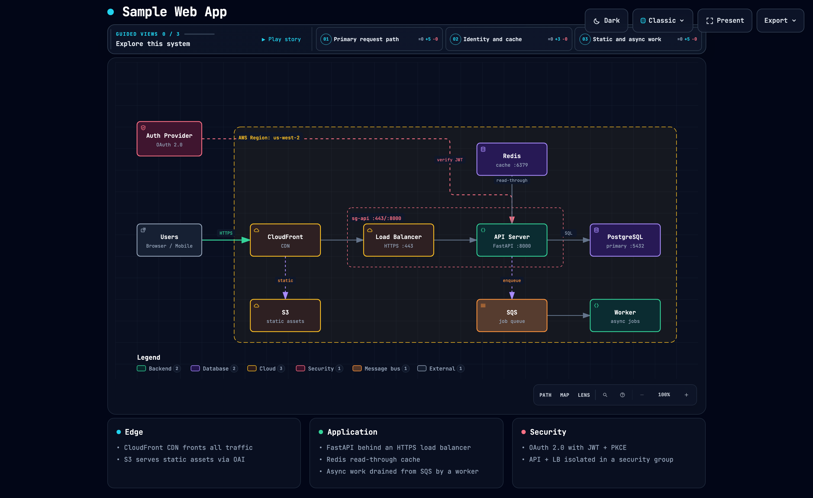
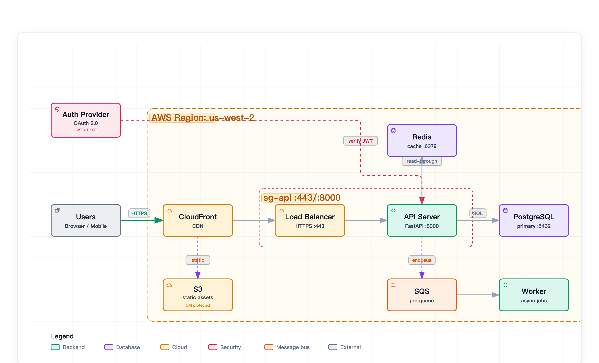
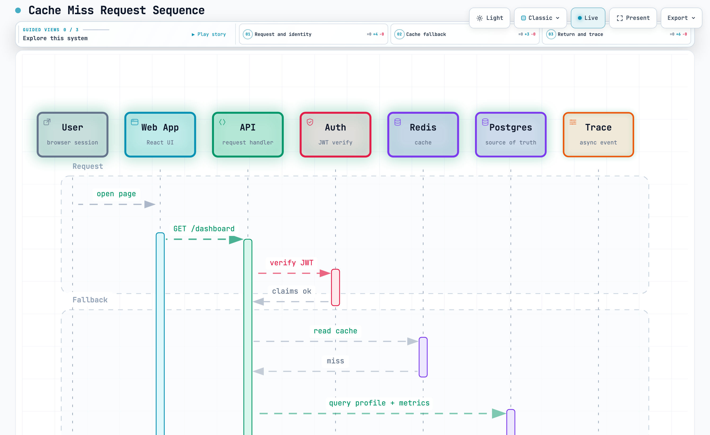
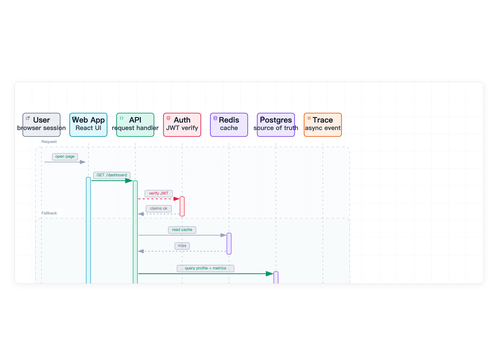

# Archify 架构与工程可视化技能 (Archify Engineering Visualizer Skill)

> **基于优质开源项目 Archify 深度定制改造，专为高校纸质教材编写、学术科研出版与现代软件工程打造的系统架构、时序图与数据流图可视化引擎。**

[](SKILL.md)
[](https://github.com/)
[](LICENSE)
[](scripts/export-clean-svg.mjs)

---

## 📢 开源渊源与致谢声明

本技能（Agent Skill）基于开源项目 **Archify** 进行深度定制与二次演进：
- **开源致敬**：感谢原作者与开源社区构建了卓越的声明式工程建模规范（DSL）、自动化拓扑布局引擎与沉浸式 Web 探索运行时；
- **定制团队**：由南昌大学 AI 赋能教学与工程团队 (NCU-AI-Educators) 针对高校教材出版、学术论文排版以及工程单一事实源 (SSOT) 自动化流水线进行了针对性算法调优与工程化功能拓展。

---

## ⚖️ 原版 Archify 的优势与局限剖析

### 🌟 原版 Archify 的核心优势 (Pros)
1. **代码即架构的声明式 DSL**：支持 Architecture（架构图）、Sequence（时序图）、Dataflow（数据流图）、Lifecycle（生命周期状态机）、Workflow（工程工作流）五大典型图表族，摆脱低效的 Visio / Draw.io 手工拖拽；
2. **惊艳的 Web 交互体验**：内置镜头聚焦预设（Camera Presets）、关系链路高光脉冲（Highlight Pulse）、缩放漫游雷达（Minimap）、深浅色主题无缝切换，是向管理者和技术团队做汇报演示的极佳载体；
3. **自动化空间布局**：无需人工计算坐标，能够智能解析服务依赖并计算泳道与连线走向。

### ⚠️ 面向学术出版与纸质印刷的痛点与不足 (Cons)
在将原版 Archify 应用于国家级规划教材、自然科学基金申报书以及学术会议论文排版时，团队发现原版具有明显的“**重浏览器交互，轻纸面印刷**”局限：
1. **Web Viewer 外壳残留无法印刷**：原版仅能导出包含大量搜索框、图例弹窗、缩放控制栏、操作底栏和暗色高对比卡片外壳的完整 HTML，无法作为纯净插图直接嵌入 LaTeX、Typst 或 Word；
2. **文字字号过小，缩放印刷发虚**：原版字号主要针对 1080P/4K 屏幕优化（通常仅 11px~12px）。一旦缩小并印刷至 A4 纸张，字迹微缩模糊，严重影响阅读体验；
3. **模块小标题纯白硬底粗暴遮挡**：原版小标题与分组标签采用纯白不透明硬底，在复杂拓扑网络中极易粗暴遮盖底层的流程箭头与关键结构；
4. **字号放大时文字向左严重溢出**：原版标题框宽度为静态写死，简单粗暴加大字号会导致文字在框内向左溢出，失去几何居中；
5. **视口裁切过窄导致虚线框断裂**：原版提取静态 SVG 时视口外边距过贴，外层虚线容器框和泳道底部经常被腰斩，无法闭合；
6. **连接箭头被放大卡片“吞没”**：文字和节点放大后，原版的连线端口吸附位置未自适应偏移，导致箭头被放大的卡片边框压住或遮挡。

---

## 🚀 本 Skill 的重大升级与关键改进 (Our Enhancements)

针对上述痛点，南昌大学团队对 Archify 进行了工程级重构与能力增强，固化出出版级纯净矢量转换引擎，确保了 **7 项出版级转换不变量**：

| 痛点问题 | 原版表现 | 本 Skill 优化改进 |
| :--- | :--- | :--- |
| **外部交互残留** | 包含搜索框、暗色背景卡片、缩放控件 | **零外壳残留 (Zero Chrome)**：内置无头 Chrome CDP 清洗管道，一键剔除全部 Web UI 交互壳 |
| **纸质可读性** | 节点文字偏小 (11~12px)，打印发虚 | **自动字号加权 (+2.5px)**：正文自动提升至 14px~16.5px，小标题相应加权，确保印刷锐利 |
| **连线遮挡问题** | 纯白不透明硬底粗暴遮盖背景连线 | **同色系半透明徽章**：小标题底色改为与文字同色系浅色（透明度 0.12~0.15），层次通透 |
| **文本框溢出** | 字体加大后文字严重向左溢出 | **几何中心居中与动态扩宽**：计算文字真实排印宽度，标签框随字号动态等比扩宽，严格居中 |
| **容器边缘闭合** | 视口紧贴导致虚线框底部被腰斩 | **智能 ViewBox 留白重算**：外围自适应扩展安全边距，虚线框与各泳道 100% 完整闭合 |
| **箭头吸附遮盖** | 连线箭头被放大的节点边缘“吞没” | **端口锚点避让重算**：自动校准连接线端点几何吸附，杜绝箭头被变大框体压盖 |
| **工具链割裂** | 无法直接被文档编译工具链集成 | **无缝融入 Typst/LaTeX 流水线**：输出 100% 独立且样式纯内联的 SVG，直接一键编译成书 |

---

## 🎯 本 Skill 的核心用途 (Target Use Cases)

1. **高校计算机/软件工程教材与教案编写**：
   - 为纸质教材、实验指导书一键生成符合国家印刷标准的超高清黑白/彩色矢量拓扑插图。
2. **科研基金申报书与重大研发计划方案**：
   - 制作国家自然科学基金、省部级重大科技攻关项目的技术路线图、系统架构图与数据流闭环图。
3. **顶级学术会议与期刊论文写作 (IEEE / ACM / CCF)**：
   - 输出纯净、紧凑、文字清晰的矢量 SVG，无损导入 Typst / LaTeX 编译流程。
4. **单一事实源 (SSOT) 自动化文档与 CI/CD**：
   - 结合 AI Coding Agent，将技术规范 Markdown、DSL 架构代码与自动化构建紧密结合，每次提交自动重新渲染出版级插图并生成最新 PDF。

---

## 🖼️ 双轨效果对比实测 (Visual Showcase)

> *注：以下示例采用通用的云原生微服务集群架构与标准分布式缓存时序，完全脱敏且不涉及任何具体商业项目或课程内容。*

### 1. 云原生系统架构拓扑 (Cloud Architecture)

| Web 富交互探索模式 (Dark Mode) | 出版级纯净矢量导出 (Publication Clean SVG) |
| :---: | :---: |
|  |  |
| *具有镜头切换、关系连线高光脉冲、缩放雷达与暗色全屏探索外壳* | *零外壳残留、字号加权提升 (+2.5px)、半透明同色系徽章，专为印刷优化* |

### 2. 分布式请求时序交互 (Sequence Diagram)

| 浏览器时序交互探索 (Light Mode) | 出版级纯净矢量时序图 (Clean SVG) |
| :---: | :---: |
|  |  |
| *交互式生命线与激活块高亮提示* | *自动视口边界留白，虚线泳道框完整闭合无裁切* |

---

## 📂 技能包目录结构

```
skills/archify/
├── SKILL.md                 # Agent 技能主定义（提示词指令、设计规范与触发条件）
├── README.md                # 本文档（原理、规格与使用说明）
├── bin/                     # CLI 执行脚本 (archify.mjs 等)
├── scripts/
│   ├── export-clean-svg.mjs # 🌟 核心无头出版级纯净矢量转换引擎 (Puppeteer / Chrome CDP)
│   ├── render-examples.mjs  # 示例批量渲染脚本
│   └── check-render-output.mjs
├── references/              # 规范参考文献库
│   ├── publication-clean-svg.md  # 🌟 出版级纯净矢量转换规范指南
│   ├── authoring-contract.md     # 声明式语法契约
│   └── viewer-runtime.md         # 交互查看器运行时
├── schemas/                 # JSON Schema 数据契约校验文件
└── examples/                # 涵盖各图表类型的典型脱敏样例
```

---

## 💬 智能体交互指南：自然语言与斜杠命令 (Prompt & Slash Commands)

在配置了 Archify 技能的 AI 智能体（如 **Google Antigravity**、**Claude Code**、**Cursor**、**Codex** 等）中，普通用户无需手动编写复杂的 JSON 建模或调用 Node 脚本，直接通过自然语言或斜杠命令即可完成全套图表的设计与无缝导出：

### 1. 自然语言交互提示词 (Prompt Templates)

您只需在对话框中直接描述业务或技术需求，AI Agent 会自动匹配并调度 Archify 技能：

- **场景 A：系统架构拓扑设计（带出版级矢量导出）**
  > *“请使用 Archify 技能，为我的系统绘制一张云原生架构拓扑图。包含客户端、API Gateway、认证中心、两台微服务业务节点，以及 Redis 缓存与 PostgreSQL 数据库。要求配色具有现代科技感，并同步导出无外壳的出版级纯净 Clean SVG。”*
- **场景 B：复杂业务调用时序图**
  > *“请帮我画一张时序图，展示 OAuth2 + PKCE 授权码模式的时序链路：SPA 前端、授权服务器、API 资源网关与用户数据源之间的重定向、Token 交换与 JWT 验签过程。”*
- **场景 C：已有 Mermaid 图表美化与升级**
  > *“我这有一段老旧的 Mermaid 架构图（粘贴代码），图例和线条比较单调。请用 Archify 重新设计为模块化拓扑，并优化字号以供论文插图使用。”*
- **场景 D：已有 HTML 图表一键清洗导出**
  > *“请将我刚才生成的 `figures/cloud-architecture.html` 转换为去除所有浏览器交互外壳、字号放大的出版级 Clean SVG。”*

### 2. 斜杠命令直接调用 (Slash Commands)

对于追求效率的用户，可以直接在 Agent 聊天框中使用斜杠命令快速调度：

```bash
# 1. 架构拓扑生成
/archify architecture 设计高可用分布式存储系统，包含协调节点、数据节点与备份服务

# 2. 业务时序图生成
/archify sequence 用户下单、库存冻结、支付回调与超时取消的时序流程

# 3. 提取出版级纯净 SVG
/archify clean docs/figures/system-architecture.html

# 4. 转换指定 Mermaid 文件
/archify convert docs/diagrams/legacy.mmd
```

---

## 🚀 快速上手 (本地 CLI 模式)

### 1. 独立安装与运行
```bash
cd skills/archify
npm install
```

### 2. 导出出版级纯净 SVG (CLI)
使用内置的无头转换脚本，将 Archify 生成的交互式 HTML 图表无损清洗为出版级纯净 SVG：
```bash
# 将单个 HTML 转换为出版级 SVG
node skills/archify/scripts/export-clean-svg.mjs diagram.html output-clean.svg

# 针对特定图表类型指定推荐视口预设
node skills/archify/scripts/export-clean-svg.mjs system.html system.svg --diagram-type architecture
```

### 3. 与 Typst 协同工作流
1. 让 AI Agent 调用 `archify` 技能生成目标系统架构图或时序图；
2. 运行 `export-clean-svg.mjs` 得到 `figure-1.svg`；
3. 在 SSOT Markdown 文档中直接引用：
   ```markdown
   
   ```
4. 使用 `typst` 技能一键编译出排版完美的 A4 双面学术 PDF！

---

## 📜 开源协议

本项目脚本部分遵循 **MIT** 协议。
南昌大学 AI 赋能教学团队 (NCU-AI-Educators) 维护升级。
